# Introduction
This tutorial explains how to create an EC2 instance using the AWS Console.

# First Steps
If you haven't already, you'll need to [sign up for an AWS account](http://aws.amazon.com/)
in order to complete this tutorial. If you have access to a corporate account
and have permission to use it for learning purposes, you can use that
as well.

# Tutorial
Creating an EC2 instance using the AWS console is fairly easy. They have
a pretty good wizard that walks you through the process.

### Log into the AWS Console
Once you're logged into your account, you should be able to see the main
console screen with all the AWS services listed:

### Go to the EC2 main page
Select the EC2 service from the service list on the main page. You
should be taken to the main EC2 instances page:

### Go to the instances list
Click the *Instances* link on the left sidebar of the EC2 main page.
You should be taken to a page that lists all the EC2 instances in
the account:

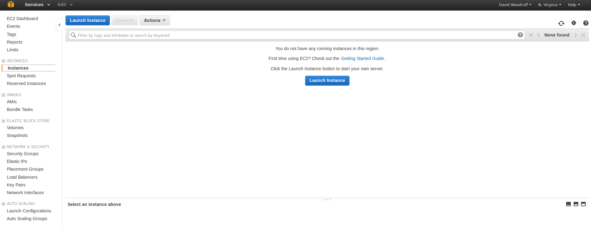

### Start the launch instance wizard
On the instances page, click the *Launch Instance* button near the top
of the screen. It will take you to the first screen of the wizard:

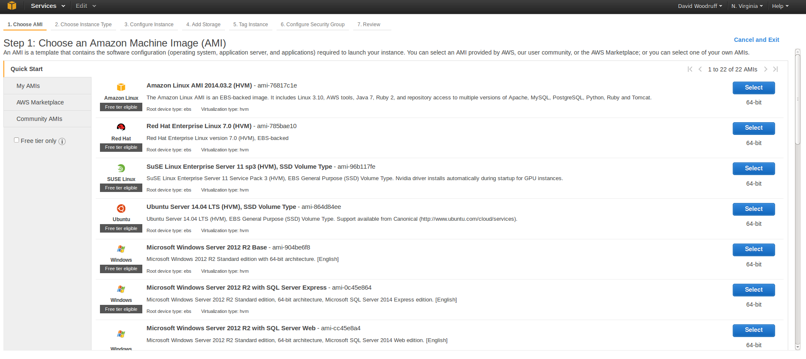

### Choose an Amazon Machine Image (AMI)
On this screen, you can select the type of Amazon Machine Image (AMI)
that you want to use in launching your instance. An AMI is essentially
a snapshot of a base machine containing all the core things like an
operating system and related tools that you'll need.

There are several different AMIs for various operating systems. For the purposes of this
tutorial, select the *Amazon Linux AMI*.

Once you've selected your AMI you should be taken to a screen that
looks like this:

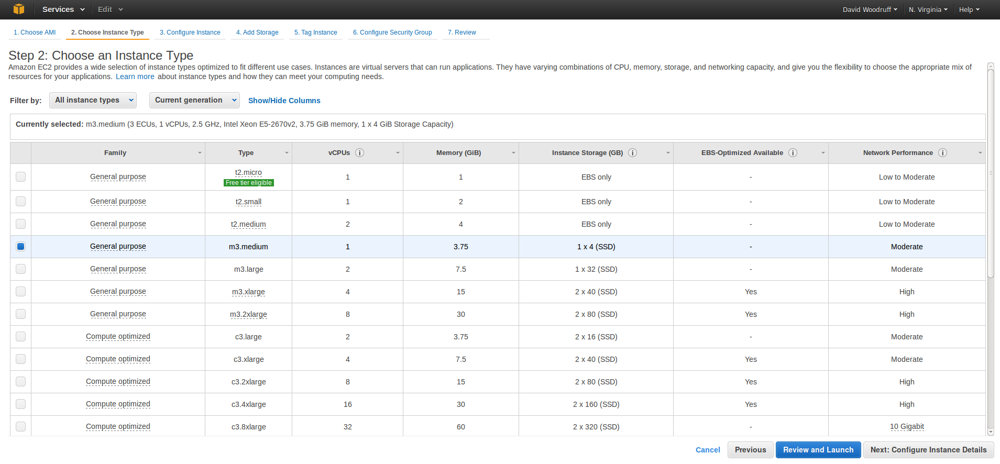

### Select an instance type
On this screen you select the instance type you want to use in launching
your machine. Instance types specify how many resources will be allocated
to your new instance. Each instance type has different values for these
resources:

* CPU
* Memory
* Hard Disk Storage
* Network Performance (I/O)

I selected the *m3.medium* instance type in this screenshot.

Once you've selected your instance type, click the *Next: Configure
Instance Details* button. It should take you to a screen that
looks like this:

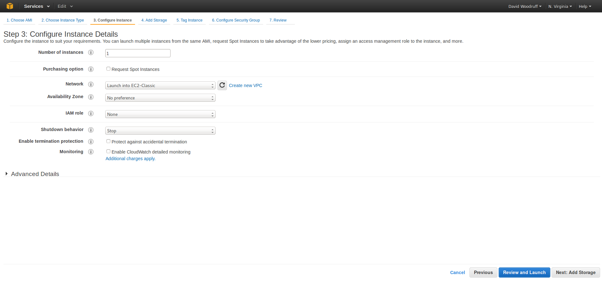

### Configure instance details
The *Configure Instance Details* has mostly some more advanced options
that we're not going to cover in this tutorial. Leave everything as the
default values and click the *Next: Add Storage* page. It should take
you to a screen that looks like this:

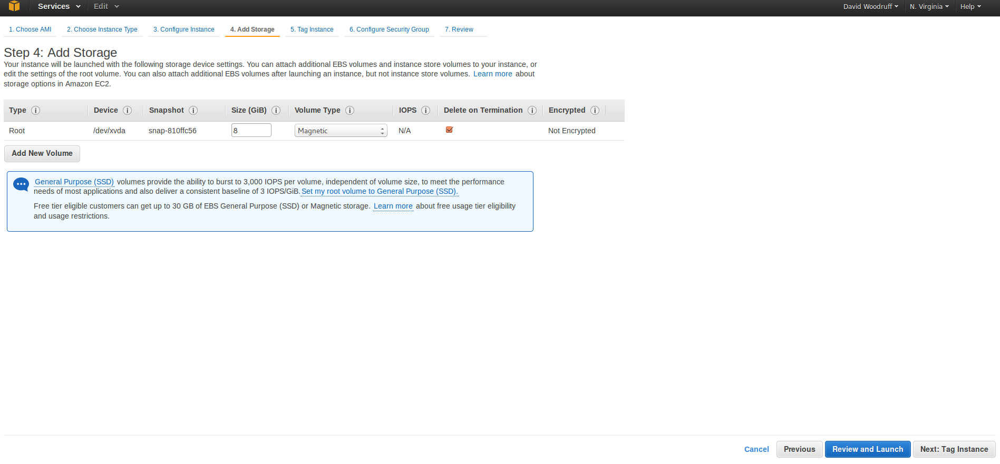

### Add storage
On this page you can configure how many hard disks get attached to your
instance, as well as what size they are. Leave these values at the defaults
of one 8GB disk.

Click the *Next: Tag Instance* button and you should be taken to a page
like this:

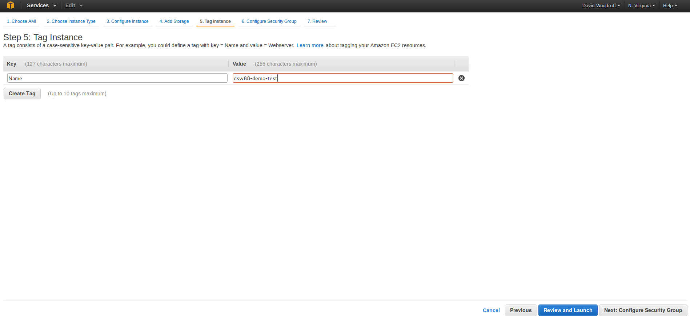

### Tag instance
On the tags page, you can add tags to your instance. Tags are key/value
pairs that can be useful in a variety of situations:

* Identifying your instance in the console
* Resource management
* Generating automated reports
* Security

The most common tag for EC2 instances is the *Name* tag, which is what
gets displayed in the EC2 console. Give your instance a *Name* tag and
make the value be whatever you want to see as the name in your console.

When you're done, click the *Next: Configure Security Group* button and
you should be taken to a page like this:

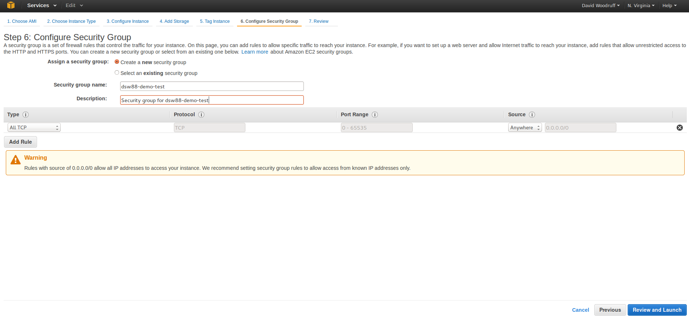

### Configure security groups
On this page you can configure security groups for your instance. Security
groups allow you to control where people can access your instance and on what ports
they can access it.

For the purposes of simplicity in this tutorial, we're just selecting the *All TCP* rule,
which allows everyone to see this instance on all ports. **DO NOT use this
rule in real-life usage!!!** In a real-world scenario, you'll want to have
your instance be as locked down as possible.

Once you've configured your security group, click the *Review and Launch*
button. Depending on whether or not you've accessed the console before,
you may see an popup modal window like this:

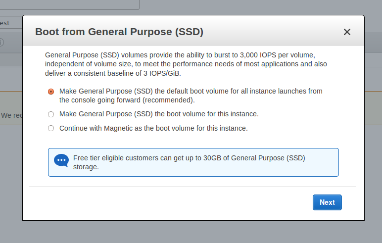

Select the recommended option for using SSD disks and select *Next*

Now you should see the review page:

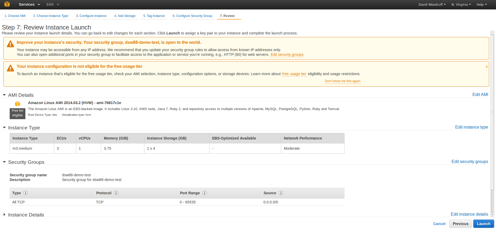

### Launch your instance
On this screen, you'll be able to review all the details you've configured
on previous screens in the wizard. Once you verify that everything is
correct, click the *Launch* button.

There should be a popup modal window that asks you which keypair you
want to use:

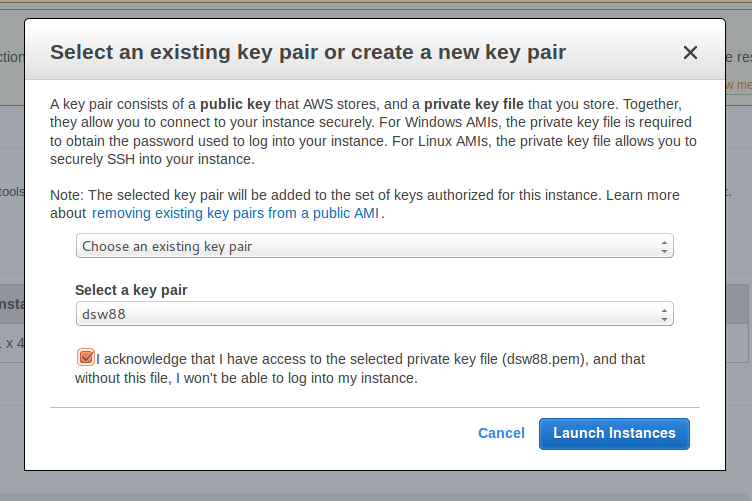

This keypair is used for accessing your EC2 instance if you need to SSH
to it. If you already have a keypair in AWS, use that one. Otherwise
use the window to create and download a new keypair.

**You will not be able to download your keypair again, so make sure you
save it someplace safe.**

Your instance should now be launching. Go back to the EC2 instances list
and you should see your launching instance:

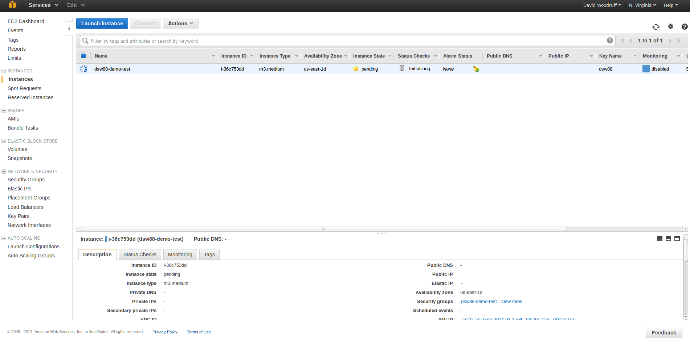

# Cleanup
Once you've launched your instance, you'll probably want to delete it
again fairly quickly. Amazon charges you by the hour for all the instances
you use, so you'll be charged more for this instance the longer you leave
it up.

To delete you instance, right-click on it in the instances page. Select
the *Terminate* action. A popup will appear asking you if you really
want to terminate the instance. Confirm that you do, and you should see
it start to shut down on the instances page.

Once it's fully deleted it should show up on your instances page with a
*Terminated* status. It will disappear from your instances list after a
while, but you will not be charged for it as long as it's in the *Terminated*
state.
