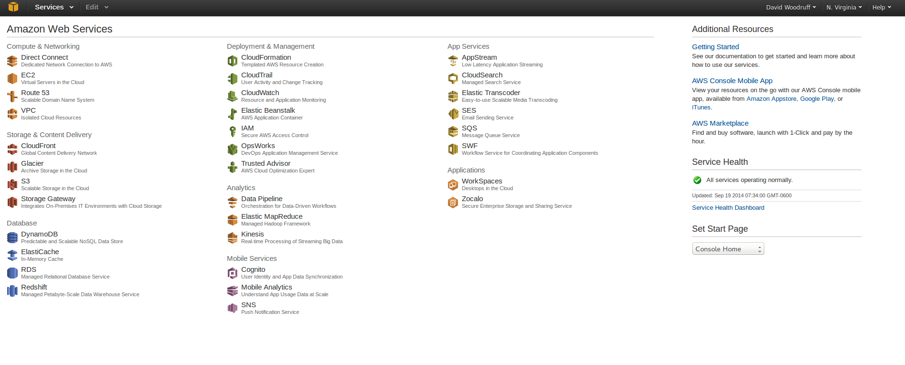
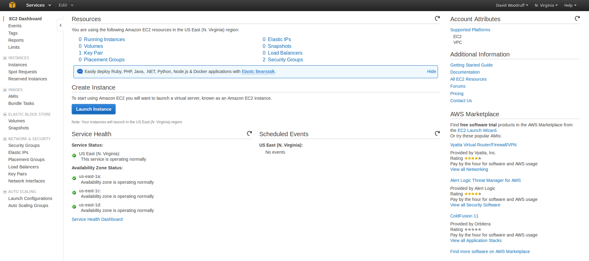
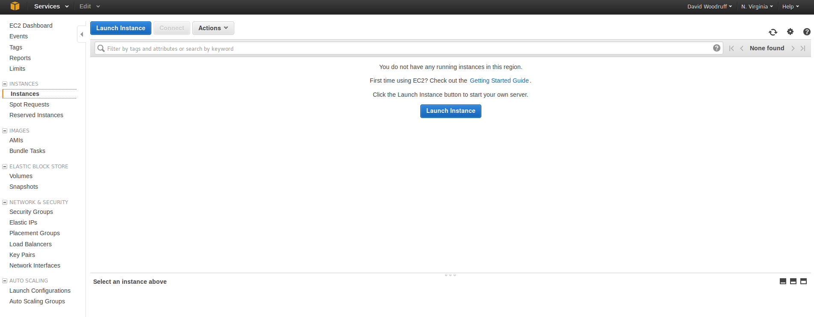

# Introduction
This tutorial explains how to create an EC2 instance using the AWS Console.

# First Steps
If you haven't already, you'll need to [sign up for an AWS account](http://aws.amazon.com/)
in order to complete this tutorial. If you have access to a corporate account
and have permission to use it for learning purposes, you can use that
as well.

# Tutorial
Creating an EC2 instance using the AWS console is fairly easy. They have
a pretty good wizard that walks you through the process.

### Log into the AWS Console
Once you're logged into your account, you should be able to see the main
console screen with all the AWS services listed:

### Go to the EC2 main page
Select the EC2 service from the service list on the main page. You
should be taken to the main EC2 instances page:

### Go to the instances list
Click the *Instances* link on the left sidebar of the EC2 main page.
You should be taken to a page that lists all the EC2 instances in
the account:

